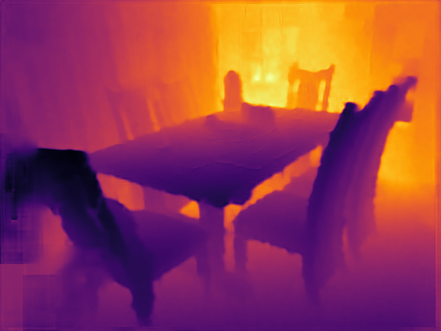

# Realtime-Depth-Estimation-Nconv



## Dataset

+ You can find preprocessed KITTI and NYUv2 dataset, as well as data collected from our spot in `/oscar/data/jtompki1/cli277`.

+ Currently I use data from `/oscar/data/jtompki1/cli277/nyuv2/nyuv2`.

+ Check `./dataset/*.py` for more information related to my dataloader.


## Model

### Overview

There are many files in `./model` and there are even more different experimental models in each file. Basically there are three kinds of models. (`./models/smallModelTwoInput.py` contains latest models)


### Step1 Model

Models containing `1`

Input: `raw_depth`

Output: `estimated_depth_step1`


### Step2 Model

Models containing `2`

Input: `estimated_depth_step1` and `rgb_image`

Output: `estimated_depth_step2`

Load checkpoints from step1 and disable training for the step1 unguided model:

```python
self.step1 = STEP1()
checkpoint = torch.load("./checkpoints/step1.pth.tar")
state_dict = checkpoint["state_dict"]

new_state_dict = {}
for k, v in state_dict.items():
    name = k[7:] if k.startswith("module.") else k
    new_state_dict[name] = v
self.step1.load_state_dict(new_state_dict, strict=False)

# Disable Training for the unguided module
for p in self.step1.parameters():            
    p.requires_grad=False
```


### Model to Export

Models containing `FINAL`

Cut some edges based on the camera overlap:

```python
xout[:, :, :45, :] = 0
xout[:, :, -45:, :] = 0
xout[:, :, :, :20] = 0
```


## Training

Open `finalTrain.py`

Specify the model you would like to train (When training the step2 model, don’t forget to load and freeze the checkpoint of the step1 model)

```python
best_model = SMALL_STEP2()
model = SMALL_STEP2()
```

Specify the output checkpoint file path

```python
save_checkpoint(best_model, 1000, "./checkpoints", final_stats)
```

Modify this line if you would like to change input and output of the model

```python
estimated_depth = model(rgb, depth)
```

Sometimes the validation step will report an error after you change the input and output of the model. In this case, you have to also modify `./utils.get_performance`

Run `python finalTrain.py`


## Testing

Open `./testNYU.py`

Specify the model you would like to test and its corresponding checkpoint file.

```pytyhon
best_model = SMALL_STEP2()
checkpoint = torch.load("./checkpoints/epoch=100.checkpoint.pth.tar")
```

Run `python testNYU.py`

Check results in `./nyuresults` folder. (test data is collected from the spot, I didn't split test data from NYUv2)


## Export to ONNX

Open `./toonnx.py`

Specify the model you would like to export and its corresponding checkpoint file.

```python
model = SMALL_STEP2()
checkpoint = torch.load("./checkpoints/epoch=1000.checkpoint.pth.tar")
```

Prepare dummy input

```python
dummy_rgb = torch.randn(1, 3, 480, 640, device='cuda')
```

specify input and output of onnx

```python
input_names=['rgb_0', 'depth_0'],
output_names=['output_depth_0'],
```

Run `python ./tononnx.py`


## Reference

I borrow [nconv](https://arxiv.org/abs/1811.01791) code from their [implementation](https://github.com/abdo-eldesokey/nconv).

May contain some code from [bpnet](https://github.com/kundajelab/bpnet), but is not in use.